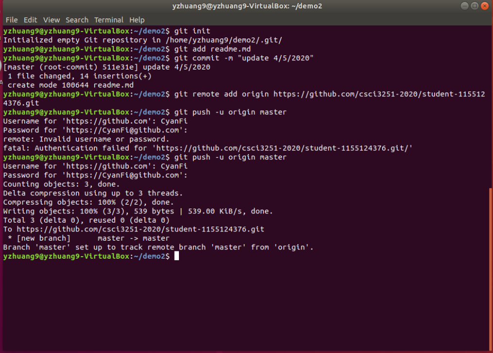

# CSCI3251 Github Project
## Personal info
- Name: **Huang Yizhan**
- Study interest: data structures & algorithms, deep learning
- View my works: [Codeforces](https://codeforces.com/profile/qingyuge006), DNN Heterogeneous Computing Optimization (Going on)
- To-learn topics 
  - [x] deep-learing@Coursera
  - [x] 18.04 @MIT-Opencourse
  - [x] TVM

| Codeforces Div 1 | Codeforces Div 2 |
| ---------------- | ------------- |
| Sometimes a problem| >=3 problem | 
| N/A | 1500-2500 ranking | 

